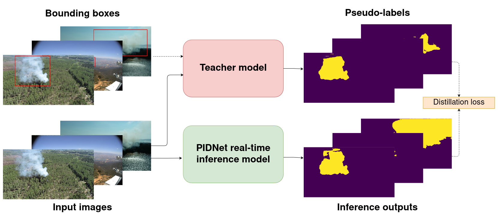

# Detecting Wildfires on UAVs with Real-time Segmentation Trained by Larger Teacher Models



Code for the Detecting Wildfires on UAVs with Real-time Segmentation Trained by Larger Teacher Models. To recreate results from the paper go to [Quick Start](#quick-start) after [Installation](#installation). Currently only a portion of the data is available. The rest will be available at a later date.

## Results and checkpoints

Currently only the AI For Mankind data result, shown here in the first table, can be replicated due to data availability. However, the rest of the pretrained models can also be used and tested with the linked data or available smoke images.

SAM supervised dataset separated tests (Table 4. row 5.):

| Teacher Model | Student Model | UAV mIoU | AI For Mankind mIoU |
|---------------|---------------|----------|---------------------|
| SAM | [PIDNet-S](https://drive.google.com/file/d/11QJKRjko9rIOpasyoo4Q9U6qzmRuAVg-/view?usp=drive_link) | 0.689 | 0.498 |


Model comparison SAM supervised results (Table 2. Rows 5, 10, 15 and 20):

| Teacher Model | Student Model | Test mIoU |
|---------------|---------------|-----------|
| SAM           |               |   0.636   |
| SAM           | [PIDNet-S](https://drive.google.com/file/d/11QJKRjko9rIOpasyoo4Q9U6qzmRuAVg-/view?usp=drive_link)      |   0.594   | 
| SAM           | [PIDNet-M](https://drive.google.com/file/d/1ny_6mTnhPArqCnacGuidj9uc-tkTAokE/view?usp=drive_link)      |   0.606   | 
| SAM           | [PIDNet-L](https://drive.google.com/file/d/1ACFYUGqBHWo4wfxKJUdr9BwSjdTI11i5/view?usp=drive_link)      |   0.594   | 

Final SAM model with loss function ablation (Table 6. row 3.):

| Teacher Model | Student Model | Test mIoU |
|---------------|---------------|-----------|
| SAM | [PIDNet-S with loss ablation](https://drive.google.com/file/d/13wmJ_onh9p3eS0zTK_TyBR0OeRPKuh3P/view?usp=sharing) | 0.633 |


## Installation

The code has been developed in a Python 3.8 environment. For other Python versions package conflicts may occur. To create the environment with Conda (To install Conda follow the [official instructions](https://conda.io/projects/conda/en/latest/user-guide/install/index.html)):

`git clone https://gitlab.com/fgi_nls/public/wildfire-real-time-segmentation.git`

`cd wildfire-real-time-segmentation`

`conda create -n wildfire_seg python=3.8`

`conda activate wildfire_seg`

Optional step required only if you want to generate masks with SAM:

`pip install git+https://github.com/facebookresearch/segment-anything.git`

Required for everything:

`pip install -r requirements.txt`

On Windows systems to enable CUDA support follow the [official Pytorch instructions](https://pytorch.org/get-started/locally/).

## Quick start

Before running the python scripts follow the installation instructions in [Installation](#installation). Download the available [AI For Mankind Data](https://drive.google.com/file/d/1mbthNoeld-DnfrBxH8Ok9V1w5G52qC3P/view?usp=sharing) and extract it to main directory.

All code can be run on a CPU with the argument `--device cpu`.

### Recreate the results with pretrained models

Download the model checkpoints from [Results and checkpoints](#results-and-checkpoints) and place them in the checkpoints folder.

Then to recreate individual model results:

`python eval.py --single-model [model-checkpoint-path] --model-size [s,m,l]`

To evaluate only the SAM pseudo-labels:

`python eval.py --eval-sam`


### Generate the wildfire masks with SAM

#### Requirements: 

From the SAM repository: https://github.com/facebookresearch/segment-anything download the trained model checkpoints and place them in the folder 'checkpoints'. For the study, we have used the ViT-H model.

#### Generate masks:

`python generate_pseudo_labels.py --model vit_h --dir data --mode test --output-dir pseudo_labels`

To generate masks for custom data follow the data organisation described in [Model training](#model-training).

### Model training

The training with full data is currently **unavailable** due to data availability but will be updated later. The training code is still provided as a reference and could be adapted for custom data. The training can also be tested with the AI For Mankind data.

To train:

`python train.py`

For training with custom data, organise the data according to the default dataset:

```
├── custom_data
| ├── images
| | ├── train
| | ├── valid
| | ├── test
| ├── labels
| | ├── train
| | ├── valid
| | ├── test
| ├── sam_masks
| | ├── train
| | ├── valid
| | ├── test
```

`python train.py --data-dir custom_data`

To generate the pseudo-labels with SAM refer to [Generate masks](#generate-masks).

### Visualise outputs

To generate model output visualisations:

`python infer.py --input-image [image path]`
